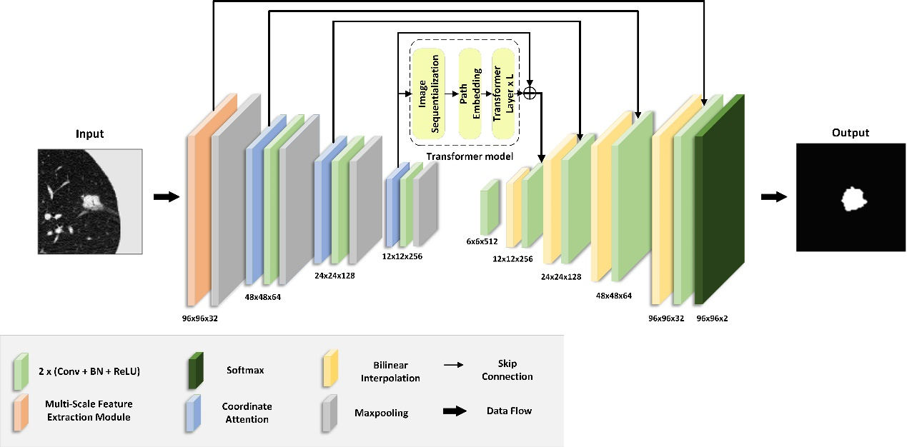

# MCAT-Net


MCAT-Net is a deep learning model for pulmonary nodule segmentation. This repository provides the model implementation, trained weights, and test paths.

## Best Model and Dataset


The pretrained `best_model and testdata` can be downloaded from the following link:

- **Google Drive**: [https://drive.google.com/drive/folders/1i8K2j-6mWsKl-ZW3ZeVvna7BTMLHeU2V](https://drive.google.com/drive/folders/1i8K2j-6mWsKl-ZW3ZeVvna7BTMLHeU2V)

## Implementation

### 1. Environment Setup

To set up a new environment, ensure you have Conda installed, then run the following commands to create a new environment and install the dependencies:

```bash
conda create -n MCAT python==3.11
conda activate MCAT
pip install -r requirements.txt

```
### 2. Path Configuration

Before running the model, update the following paths in the `global.py` file to match your directory structure:

bbox_img_path = "/home/hutianjiao/Project/Test_data/testdatas/image/"  # Path to the test images

bbox_msk_path = "/home/hutianjiao/Project/Test_data/testdatas/label/"  # Path to the test labels

best_dice_path = "/home/hutianjiao/Project/best_dice.pth"             # Path to the best model file

output_path = "/home/hutianjiao/MCAT_NET/output/"                     # Path for saving outputs.

### 3. Run the Test Script

After configuring the paths, you can run the test script. By default, the script will use GPU number '1'. If needed, you can modify the GPU index in the script.
(i.e.: (DEVICE = torch.device("cuda:1" if torch.cuda.is_available() else "cpu")) in `test.py`)

```bash
python test.py

```


